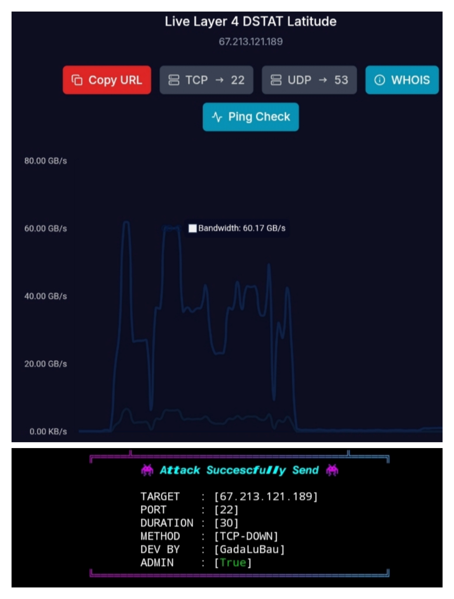
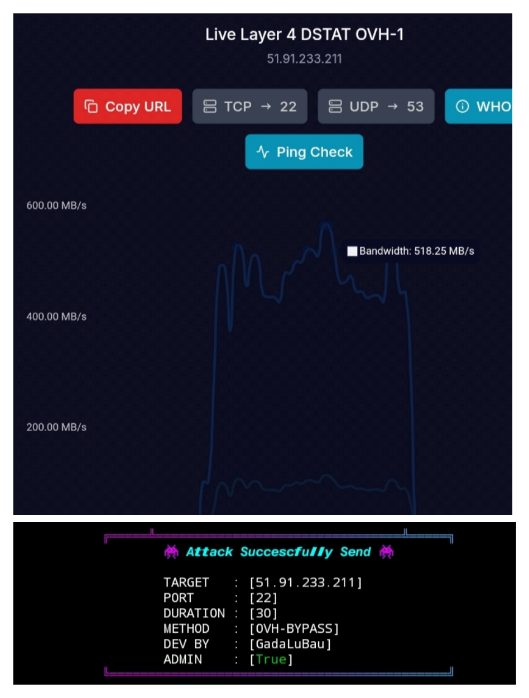

# 🚀 SONIC NETWORK – CLI PANEL DDOS

<p align="center">

</p>

<p align="center">

</p>

<p align="center">


</p>

---

## 💀 ABOUT SONIC NETWORK

**SONIC NETWORK** is a lightweight CLI network testing panel built using Python.

Designed for:
- Cybersecurity learning  
- Network simulation research  
- Educational laboratory testing  

This project is strictly for educational purposes only.

---

## ⚡ FEATURES

- ✔ Cyber CLI Interface  
- ✔ Login Authentication System  
- ✔ Command Parsing Engine  
- ✔ Layer4 / Layer7 / AMP Methods  
- ✔ Attack Execution Banner  
- ✔ Timer Based Execution System  

---

## 📂 PROJECT STRUCTURE

```
SONIC-NETWORK/
│
├── preview/
│   └── preview.jpg
│
├── main.py
├── src/
│   └── layer4/
│       ├── TCP-DOWN
│       └── methods
│
├── LICENSE
└── README.md
```

---

## 🖥 COMMAND FORMAT

Inside CLI panel:

```
METHOD <target> <port> <threads> <pps> <time>
```

Example:

```
TCP-DOWN 127.0.0.1 80 100 1000 60
```

---

## 🧩 HOW IT WORKS

1. User login authentication  
2. CLI command parsing using Python 
3. Subprocess execution for modules 
4. Panel banner output 
5. Timer based execution control  

---

## 🔒 SECURITY NOTICE

This project is created strictly for educational purposes.

The developer is not responsible for misuse.  
Always obtain permission before testing any network system.

---

## ⚙ REQUIREMENTS

- Python 3.x  
- Ubuntu / Debian recommended
- First run the script in the src folder to install the required modules.
- chmod +x src/layer4/* src/layer7/* src/amp/*

Install dependencies:

```
pip install -r requirements.txt
```

---

## 👤 DEVELOPER

**GadaLuBau**  
SONIC NETWORK

---

## ⭐ SUPPORT

If you like this project:

⭐ Star Repository  
🍴 Fork Project  
🛠 Improve and Contribute  

---

## ⚠ DISCLAIMER

This tool is intended only for:
- Educational research  
- Cybersecurity learning  
- Authorized testing environments  

Unauthorized usage is prohibited.
